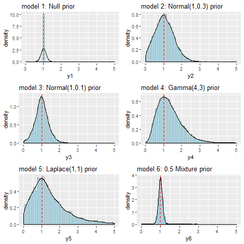

# PlotPrior
Plot the prior (with hyper-prior) of your Bayesian models from using density and ggplot

<object data="priordist.PDF" type="application/x-pdf" title="SamplePdf" width="500" height="720">
    <a href="priordist.PDF">PDF</a> 
</object>
